# Proje Adı: Zenity ile Basit Envanter Yönetim Sistemi 📝  
Bu proje ile Linux terminalinden Zenity arayüzü ile yönetici veya kullanıcı olarak giriş yapabilirsiniz. Ardından rolünüze bağlı olarak eğer yöneticiyseniz ürün ekleyebilir, silebilir veya güncelleyebilirsiniz. Diğer kullanıcıların bilgilerini güncelleyebilir, onları silebilir ya da yeni kullanıcılar ekleyebilirsiniz. Kullanıcı olarak giriş yaptıysanız da ürünleri listeleyebilir ve ürünler hakkında rapor alabilirsiniz. 

---

## Projenin Tanıtım Videosu ▶️
- https://www.youtube.com/watch?v=HRTsbc7fM5k

---

## Özellikler 🚀  
- Zenity ile basit ve anlaşılır UI. 
- Kullanıcıları ve ürünleri .csv uzantılı dosyaya kaydeden bir veritabanı.  
- Verilerin kritik işlemlerde ve istenildiğinde yedeğinin alınabilmesi.  
- Yönetici ve kullanıcı olarak ayrılan rütbe ilişkisi. 

---

## Ana Menü 🛠  
- **Ürün Ekle**
- **Ürün Listele**
- **Ürün Güncelle**  
- **Ürün Sil**
- **Rapor Al**
  - **Stoğu 50'nin Altında Olan Ürünler**
  - **En Fazla Stoğa Sahip Ürün**
  - **Ürünlerin Toplam Değeri**
  - **Geri Git**
- **Kullanıcı Yönetimi**
  - **Yeni Kullanıcı Ekle**
  - **Kullanıcıları Listele**
  - **Kullanıcı Güncelle**
  - **Kullanıcı Sil**
  - **Geri Git**
- **Program Yönetimi**
  - **Diskteki Alanı Göster**
  - **Diske Yedekle**
  - **Hata Kayıtlarını Göster**
  - **Geri Git**
- **Çıkış**
  
---

## Envanter Yönetim Sisteminin Kullanılış Demosu 🖥 
Bu kısımda görseller ile sistemin kullanılışı anlatılacaktır.

<table>
  
  <tr>
    <td>
      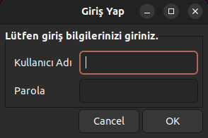
    </td>
    <td>
      Bu ekranda sisteme giriş yapabilirsiniz. Sistem çalıştırıldıktan sonra otomatik olarak adı <b>admin</b> şifresi <b>admin</b> olan bir hesap oluşturulur. Bu hesap yöneticidir.
    </td>
  </tr>
  
  <tr>
    <td>
      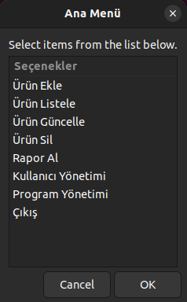
    </td>
    <td>
      Ana menüde envanter yönetim sisteminde gezinebilir, yapmak istediğiniz işleme göre sunulan seçekenleri seçebilirsiniz. Burada dikkat edilmesi gereken detay yönetici olmayan kullanıcıların sadece <b>Ürün Listele</b> ve <b>Rapor Al</b> seçeneklerini seçebilmesidir.
    </td>
  </tr>

  <tr>
    <td>
      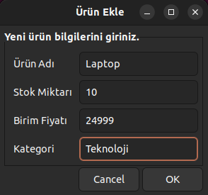
    </td>
    <td>
      Yönetici yetkisine sahipseniz ürün ekleme sayfasında istenilen bilgileri doldurarak ürün ekleyebilirsiniz. Ancak ürün isminde boşluk olmamalıdır. Fiyat ve stok miktarı da 0'ın altında olmamalıdır.
    </td>
  </tr>

  <tr>
    <td>
      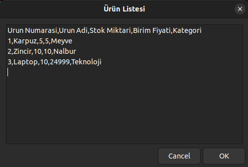
    </td>
    <td>
      Bu sayfada sistemde kayıtlı olan ürünlere ve ürünlerin bilgilerine erişebilirsiniz.
    </td>
  </tr>

  <tr>
    <td>
      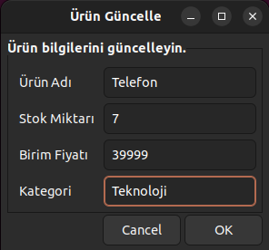
    </td>
    <td>
      Ürün güncelleme ekranında güncellemek istediğiniz ürünün adını yazıp daha sonradan istediğiniz bilgileri girerek güncelleyebilirsiniz. Yandaki görselde eklediğimiz <b>Laptop</b> ürününü <b>Telefon</b> ile değiştirdik.
    </td>
  </tr>

  <tr>
    <td>
      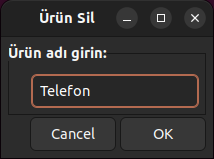
      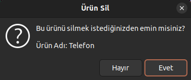
    </td>
    <td>
      Ürün silme ekranında silmek istenen ürünün adı girildikten sonra onay ekranı karşımıza çıkar.
    </td>
  </tr>

  <tr>
    <td>
      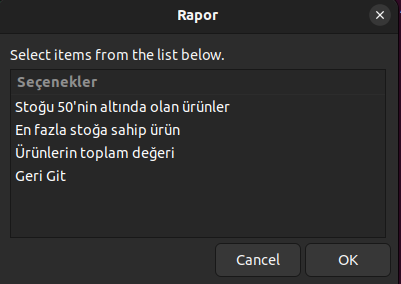
      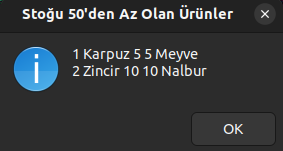
      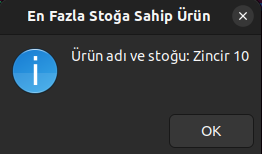
      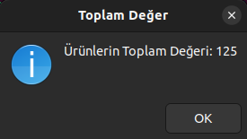
    <td>
      <ul>
        Rapor alma ekranında girildikten sonra karşımıza üç farklı rapor seçeneği çıkar.
        <li>Stoğu 50'nin altında olan ürünler</li>
        <li>En fazla stoğa sahip ürün</li>
        <li>Envanterdeki ürünlerin toplam değeri</li>
      </ul>
  </tr>

  <tr>
    <td>
      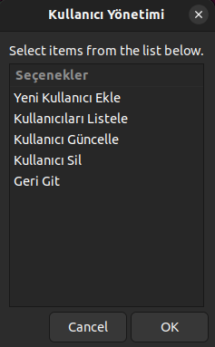
    </td>
    <td>
      Bu ekranda kullanıcılar hakkında yapılmak istenen seçenek seçilir.
    </td>
  </tr>

  <tr>
    <td>
      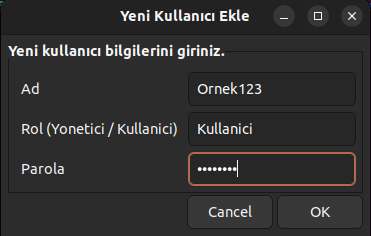
    </td>
    <td>
      Eğer yöneticiyseniz bu ekranda gereken bilgileri girerek yeni bir kullanıcı oluşturabilirsiniz
    </td>
  </tr>

  <tr>
    <td>
      
    </td>
    <td>
      Eğer yöneticiyseniz bu ekranda sistemde kayıtlı bütün kullanıcıları görebilirsiniz.
    </td>
  </tr>

  <tr>
    <td>
      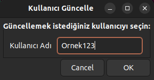
      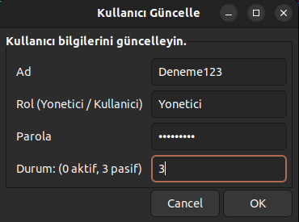
    </td>
    <td>
      Eğer yöneticiyseniz bu ekranda güncellenecek kullanıcının adını girip ardından gereken bilgileri doldurup o isimdeki kullanıcıyı güncelleyebilirsiniz.
    </td>
  </tr>

  <tr>
    <td>
      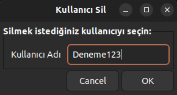
      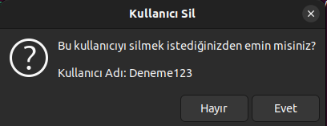
    </td>
    <td>
      Eğer yöneticiyseniz bu ekranda silinecek kullanıcının adını girip ardından onaylayarak kullanıcıyı silebilirsiniz.
    </td>
  </tr>

  <tr>
    <td>
      
    </td>
    <td>
      Bu ekranda sistem ile ilgili öğrenmek istediğiniz seçeneği seçebilirsiniz.
    </td>
  </tr>

  <tr>
    <td>
      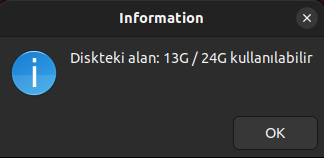
      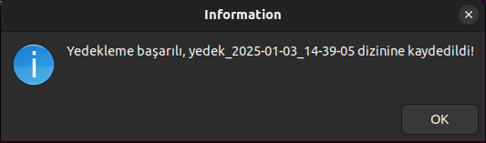
      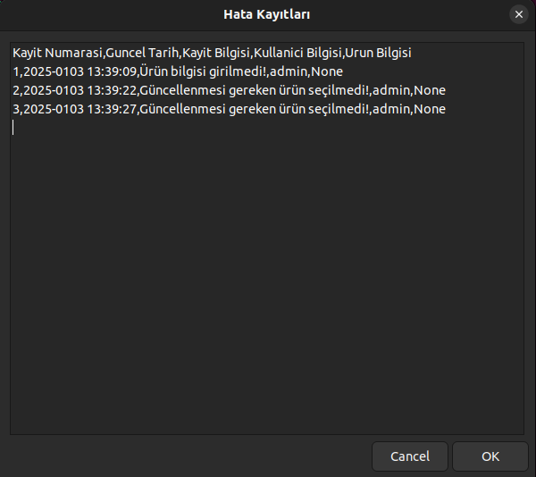
    </td>
    <td>
      <ul>
        Program yönetimi ekranına girildikten sonra karşımıza üç farklı seçenek çıkar.
        <li>Sistemde ne kadarlık bir alanın kullanıldığının bilgisini alabilirsiniz.</li>
        <li>Sistem dosyalarını farklı bir dizine yedekleyebilirsiniz.</li>
        <li>Hata kayıtlarını inceleyebilirsiniz.</li>
      </ul>      
    </td>
  </tr>
   
</table>

